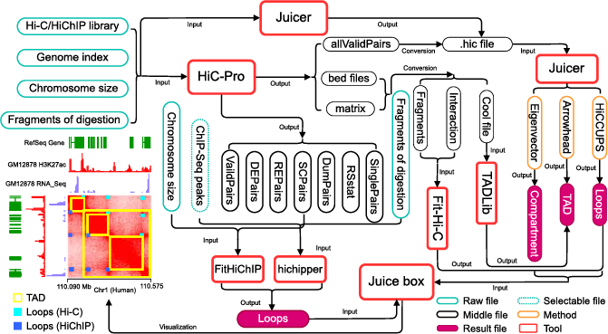
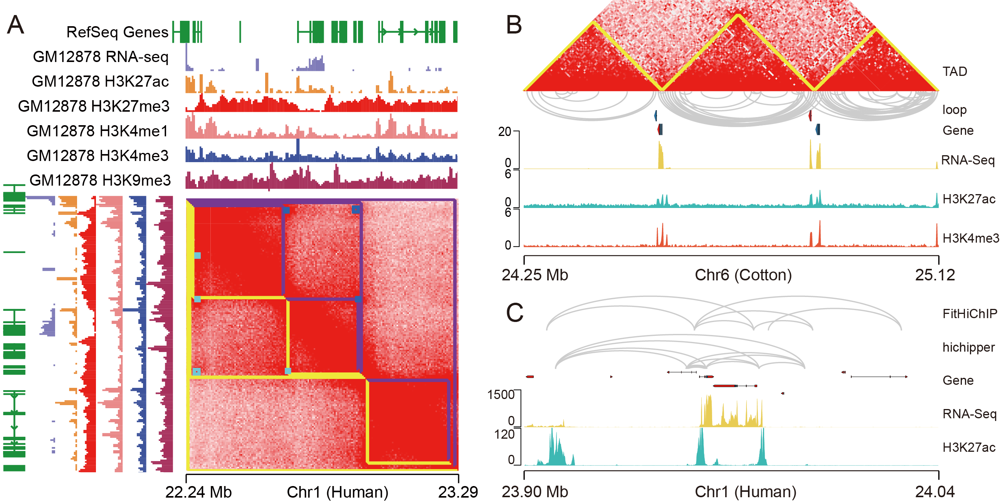

# TAD-and-loop-identification-workflows
The repository contains the code to identify TAD and loop from Hi-C and HiChIP library
# The flowchart

# Rawdata
The rawdata.txt file in this folder records the original file download address, as github uploads cannot exceed 100 Mb.
# Fit-Hi-C, FitHiChIP, hichipper, HiC-Pro, Juicer, Rawdata
These folder contains Scripts required to run these software
# Fit-Hi-C
`HiC-Pro -c HiC-Pro.config -i ../Rawdata -o result -p
cd result
sh HiCPro_step1.sh
sh HiCPro_step2.sh`
# output
The folder contains the results of TADs and loops from Hi-C and HiChIP library
# result visualisation

# workflow.sh
The script record the run commands of theses tools
