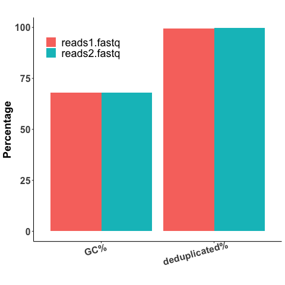

[](http://www.gnu.org/licenses/gpl-3.0)

# Data, Code and Workflows Guideline

To guide eBook authors having a better sense of the workflow layout, here we briefly introduce the specific purposes of the dir system. 


1. __cache__: Here, it stores intermediate datasets or results that are generated during the preprocessing steps.
2. __graphs__: The graphs/figures produced during the analysis.
3. __input__: Here, we store the raw input data. Data size > 100M is not allowed. We recommend using small sample data for the illustration purpose of the workflow. If you have files > 100M, please contact the chapter editor to find a solution. 
4. __lib__: The source code, functions, or algorithms used within the workflow.
5. __output__: The final output results of the workflow.
6. __workflow__: Step by step pipeline. It may contain some sub-directories. 
    - It is suggested to use __a numbering system__ and __keywords__ to indicate the order and the main purpose of the scripts, i.e., `1_fastq_quality_checking.py`, `2_cleaned_reads_alignment.py`.
    - To ensure reproducibility, please use the __relative path__ within the `workflow`.
7. __README__: In the readme file, please briefly describe the purpose of the repository, the installation, and the input data format. 
    - We recommend using a diagram to describe the workflow briefly.
    - Provide the installation details.
    - Show a small proportion of the input data unless the data file is in a well-known standard format, i.e., the `head` or `tail` of the input data.

## Overview of an example workflow: Fastq data quality checking

This is an example workflow to check the quality of the paired-end fastq files using `FastQC` software.


## Installation

- __Running environment__: 
    - The workflow was constructed based on the __Linux system__ running the Oracle v1.6 to 1.8 java runtime environment (JREs).

- __Required software and versions__: 
    - [FastQC v0.11.9](http://www.bioinformatics.babraham.ac.uk/projects/download.html#fastqc)
    - [multiqc](https://github.com/ewels/MultiQC)
    - [R 3.6.3](https://cran.r-project.org/) for results ploting
        - [RStudio 1.4](https://rstudio.com/), [ggplot2 3.3.3](https://cran.r-project.org/web/packages/ggplot2/index.html), [tidyr 1.1.2](https://github.com/tidyverse/tidyr)


## Input Data

The example data used here is the paired-end fastq file generated by using Illumina platform.  

- R1 FASTQ file: `input/reads1.fastq`  
- R2 FASTQ file: `input/reads2.fastq`  

Each entry in a FASTQ files consists of 4 lines:  

1. A sequence identifier with information about the sequencing run and the cluster. The exact contents of this line vary by based on the BCL to FASTQ conversion software used.  
2. The sequence (the base calls; A, C, T, G and N).  
3. A separator, which is simply a plus (+) sign.  
4. The base call quality scores. These are Phred +33 encoded, using ASCII characters to represent the numerical quality scores.  

The first entry of the input data:
```
@HWI-ST361_127_1000138:2:1101:1195:2141/1
CGTTNNNNNNNNNNNNNNNNNNNNNNNNNNNNNNNNNNNNNNNNNNNNNNNNNNNNNNNNNNNNNNNNNNNNNNNNGGAGGGGTTNNNNNNNNNNNNNNN
+
[[[_BBBBBBBBBBBBBBBBBBBBBBBBBBBBBBBBBBBBBBBBBBBBBBBBBBBBBBBBBBBBBBBBBBBBBBBBBBBBBBBBBBBBBBBBBBBBBBBB
```


## Major steps

#### Step 1: running the FastQC to conduct quality checking
- Note that you have to normalize the path in the shell script.

```
sh workflow/1_run_fastqc.sh
```

#### Step 2: aggregate results from FastQC

```
sh workflow/2_aggregate_results.sh
```

#### Step 3: view the results

- Results can be visualized by clicking `output/multiqc_report.html`.
- Alternatively, you can plot the results yourself using the below R code.

```
3_visualize_results.Rmd
```

## Expected results



## License
It is a free and open source software, licensed under []() (choose a license from the suggested list:  [GPLv3](https://github.com/github/choosealicense.com/blob/gh-pages/_licenses/gpl-3.0.txt), [MIT](https://github.com/github/choosealicense.com/blob/gh-pages/LICENSE.md), or [CC BY 4.0](https://github.com/github/choosealicense.com/blob/gh-pages/_licenses/cc-by-4.0.txt)).
